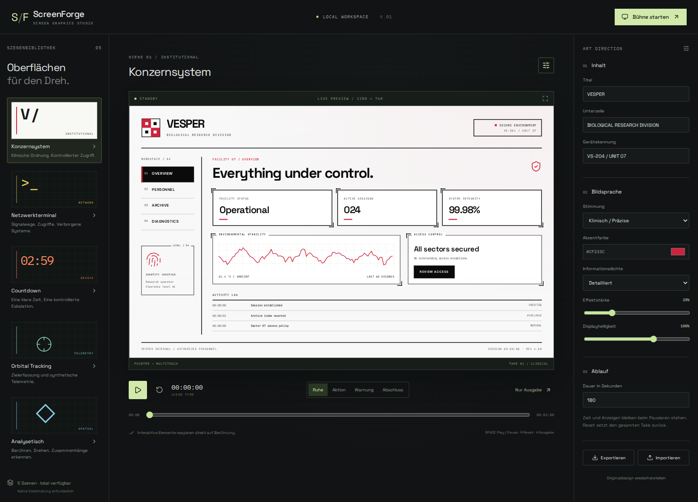

# ScreenForge

Interaktive Filmoberflächen mit React, TypeScript, Motion und Vite. Alle angezeigten Systeme sind Fiktion. Keine Shell-Ausführung, kein Netzwerkzugriff aus Szenen, keine Waffentechnik. Lokale SVG-Grafiken und eigenständige Szenen. Das Konzernsystem verwendet die vom Nutzer vorgegebene helle, schwarz-rote Designreferenz aus Neuroklast/umbrella-corp-band-t.

## Konzept (Soll-Zustand)

Das fachliche Konzept und das Usability-Konzept (englisch, taktisch/fiktiv) beschreiben den Zielzustand: Modi (Film & TV, Training, Demo), alle Rollen, freier Einsatzbaukasten per Drag & drop mit 1..n Geräten und optionalen Entitäten, Szenario-Vorlagen sowie Startseiten mit geführtem und Expertenmodus.

- Einstieg: [docs/konzept/README.md](docs/konzept/README.md)
- Ist/Soll-Abgleich für die Umsetzung: [docs/konzept/domain/12-gap-analysis.md](docs/konzept/domain/12-gap-analysis.md)

## Windows: starten

1. ZIP vollständig entpacken.
2. Node.js 24 LTS inklusive npm installieren, falls noch nicht vorhanden.
3. `start-vite.bat` doppelklicken.
4. Beim ersten Start werden Pakete installiert. Danach ist für den normalen Start kein Internet nötig.
5. Das Konsolenfenster offen lassen. Beenden mit Strg+C.

Adresse: http://127.0.0.1:5173. Bei belegtem Port stoppt der Start mit Fehlermeldung, statt unbemerkt einen anderen Port zu verwenden.

Für ein Tablet oder einen Touchscreen im selben Netzwerk: `start-lan.bat` starten und die angezeigte Network-Adresse auf dem Gerät öffnen. Gegebenenfalls Windows-Firewall für das private Netzwerk freigeben. Dieser Entwicklungsserver hat keine Anmeldung und gehört nur in ein vertrauenswürdiges Netzwerk. Geräte spielen unabhängig, ohne gemeinsame Regiesynchronisation.

## Enthaltene Szenen

- **VESPER:** Helles Konzernsystem mit schwarzen Technikrahmen und roten Akzenten nach der Umbrella-Designreferenz. Navigation, Verzeichnissuche, Zugriffszustände und Diagnose.
- **BLACKLINE OS:** Cyberpunk-Betriebssystem mit sieben Anwendungen, lokalem Terminal, Dateisystem, Personalakten, Datenclustern, 4D-Projektion und Sequenzbibliothek.
- **Sequence Control:** Countdown mit Pause, Zeitsprung, automatischem Stopp bei null und fiktiven Gerätediagnosen.
- **Orbital Survey:** originale schematische Karte mit Touchgesten und Zielerfassung. Keine realen Satellitenbilder.
- **AEON:** interaktive SVG-Darstellung einer räumlichen Baugruppe, Analyseansichten und Touchtransformationen. Kein echtes 3D-Modell und kein Handtracking.

## Vorschau



Weitere Screenshots: [Countdown](docs/previews/countdown.png), [Terminal](docs/previews/terminal.png), [Tracking](docs/previews/tracking.png), [Analysetisch](docs/previews/hologram.png).

## Bedienung

Szenen links auswählen. Inhalte, Stimmung, Akzentfarbe, Effekte, Dichte und Helligkeit rechts einstellen. Ein Szenenwechsel lädt deren Originaldesign. Individuelle Varianten vor dem Wechsel als JSON exportieren. Das zuletzt eingestellte Preset wird automatisch im Browser gespeichert.

- **Abspielen / Pause:** gemeinsame Szenenuhr.
- **Reset:** Zeit, Szene, Texteingaben, Gestentransformation und Zustände zurücksetzen.
- **Zeitleiste:** Zeitabhängige Anzeigen direkt ansteuern. Sie spielt keine vergangenen manuellen Eingaben nach.
- **Ruhe / Aktion / Warnung / Abschluss:** manueller Szenenzustand. Seine Darstellung ist szenenspezifisch.
- **Bühne starten:** Ausgabe ohne Editor im Vollbild, sofern vom Browser erlaubt.
- **Nur Ausgabe:** Ausgabe ohne Browser-Vollbild.
- **Escape:** Studio wieder einblenden. Browser-Vollbild bei Bedarf nochmals per Escape verlassen.
- **H:** Ausgabe umschalten, **Leertaste:** Play/Pause, **R:** Reset. Shortcuts greifen nicht in Eingaben oder auf fokussierten Buttons.
- Im Ausgabemodus erscheint der Rückkehrknopf unten links beim Überfahren oder Tastaturfokus. Auf Touchgeräten bleibt er schwach sichtbar.

Karte und Hologramm: ein Finger oder linke Maustaste verschiebt, zwei Finger zoomen und drehen. Mausrad zoomt. Im Studio gibt es zusätzlich Zoom-, Dreh- und Resetknöpfe. Bewegungen sind begrenzt. Die Darstellung ist eine fest proportionierte 1280×760-Bühne, die in den verfügbaren Bildschirm eingepasst wird.

## Presets

JSON-Export und validierter Import. Version 1, höchstens 100 KB. Importierte Texte werden als Text gerendert, nicht als HTML. Eine fehlerhafte Datei verändert die laufende Konfiguration nicht. Beispielpresets liegen in `presets/`.

## Entwicklung

```sh
npm ci
npm run dev
npm test
npm run build
npx playwright install chromium
npm run test:e2e
```

`npm run preview` stellt den Build auf http://127.0.0.1:4173 bereit. `dist/` enthält auch alle benötigten Schriften. Der Build benötigt einen HTTP-Server, er ist nicht für einen Doppelklick auf index.html vorgesehen.

## Repository

Repository: https://github.com/Neuroklast/screen-forge

```sh
git clone https://github.com/Neuroklast/screen-forge.git
cd screen-forge
npm ci
npm run dev
```

Unter Windows startet `start-vite.bat` die Installation und den Vite-Server. `publish-github.bat` ist nur für eigenständige Kopien ohne vorhandenen origin-Remote vorgesehen.

## Architektur

- `src/core/config.ts`: Szenenkatalog, Voreinstellungen, Zod-Schema und Export.
- `src/core/runtime.ts`: gemeinsame monotone Szenenuhr und deterministische Daten.
- `src/components/GestureSurface.tsx`: Pointer Events, Pan, Pinch, Rotation und Abbruchbehandlung.
- `src/scenes/Scenes.tsx`: fünf originale Szenen mit lokalen Zuständen.
- `src/styles.css`: Studiooberfläche, Familiengestaltung und gemeinsame Designtokens.
- `docs/ART_DIRECTION.md`: Regeln für zusätzliche Szenen.

## Stand und Grenzen

Version 0.1 ist ein funktionsfähiger Grundstock. Noch nicht enthalten: Ereignisaufnahme und -wiedergabe, ferngesteuerte zweite Ausgabe, Videoexport, frei platzierbare Panels, externe Medienverwaltung, frei konfigurierbare Ablaufsequenzen, Electron und Handtracking. Die Regieknöpfe setzen den aktuellen Zustand, sie schreiben noch kein Ereignisprotokoll.

Zeitabhängige Daten sind deterministisch. Die kurze Motion-Konturanimation beim Start einer Hologrammanalyse ist eine unmittelbare Interaktionsanimation und läuft unabhängig von der Szenenuhr. Für einen späteren framegenauen Videoexport muss sie an die Szenenzeit gebunden werden.

Der Windows-Launcher ist erstellt und auf Fehlerpfade geprüft, wurde in dieser Linux-Umgebung aber nicht unter Windows ausgeführt. Multitouch wird automatisiert über Pointer Events geprüft. Reale Touchhardware und Kameraabnahme stehen noch aus.

Für Kameraaufnahmen immer Bildrate, Belichtung, Moiré, Bildschirmhelligkeit und Lesbarkeit am Zielgerät prüfen. Ein Browser-Screenshot ersetzt diese Abnahme nicht.

## Designupdate Konzernsystem

Bei bereits gespeicherten lokalen Einstellungen kann die bisherige Akzentfarbe erhalten bleiben. Mit „Originaldesign wiederherstellen“ oder Import von `presets/corporate.json` wird die neue rot-weiße Voreinstellung geladen.

## BLACKLINE OS

Über „Netzwerkterminal“ öffnen. Die Seitenleiste schaltet zwischen Workspace, Terminal, Filesystem, Personnel, Data clusters, 4D projection und Sequences um.

- Terminal: lokale Befehle wie `help`, `ls`, `cd`, `cat`, `open`, `scan`, `decrypt`, `correlate`, `reconstruct` und `lock`; Verlauf und Tab-Vervollständigung. Für freie Befehle „Vorbereitetes Tippen“ ausschalten.
- Sitzung sperren: drei Slider-Stufen ausrichten, danach den Kontaktsensor 3,5 Sekunden halten. Loslassen bricht den Scan ab. Entsperren startet den Bootablauf. Tastatur: Slider mit Ende bestätigen, Sensor mit Leertaste halten.
- Sechs Sequenzen: Boot 108 s, Intrusion 130 s, Decryption 106 s, Cluster analysis 112 s, Biometric analysis 76 s, Reconstruction 116 s. Insgesamt 31 Phasen mit Ring-, Matrix-, Spektrum-, Gitter-, Trace- und Fingerprint-Ansichten.
- „Run full operation“ verbindet Boot, Intrusion und Warnzustand zu 4:16 Minuten. Dauerfaktor 0,25–4. Start erweitert die Zeitleiste automatisch; Pause und Zeitsprünge steuern die prozeduralen Anzeigen.
- 4D-Projektion: Tesserakt mit 16 Ecken und 32 Kanten, XW-/YZ-Rotation sowie Touchgesten.
- „Display-Overlays“: Scanlines, Glow, Grid, Grain, Vignette, Glitch und chromatische Konturen separat einstellen. Der globale Effektregler skaliert ihre Stärke.

Die Daten bleiben lokal und fiktiv. Der Fingerprint-Sensor ist eine Halteinteraktion; er liest keine biometrischen Daten. Implementierung in `src/scenes/os/`.

Vorschau: [Workspace](docs/previews/os-desktop.png), [Dateisystem](docs/previews/os-files.png), [Personalakte](docs/previews/os-personnel.png), [4D-Projektion](docs/previews/os-dimension.png), [Analyse](docs/previews/os-sequence.png), [Sperrbildschirm](docs/previews/os-lock.png), [Warnzustand](docs/previews/os-warning.png).

Validierung: TypeScript, Produktionsbuild, 9 Unit-Tests und 9 Browser-Tests. Geprüft werden unter anderem Phasengrenzen, Vor-/Zurückspulen, Pause, Reset, lokale Befehle und der abgebrochene bzw. erfolgreiche Entsperrvorgang.
